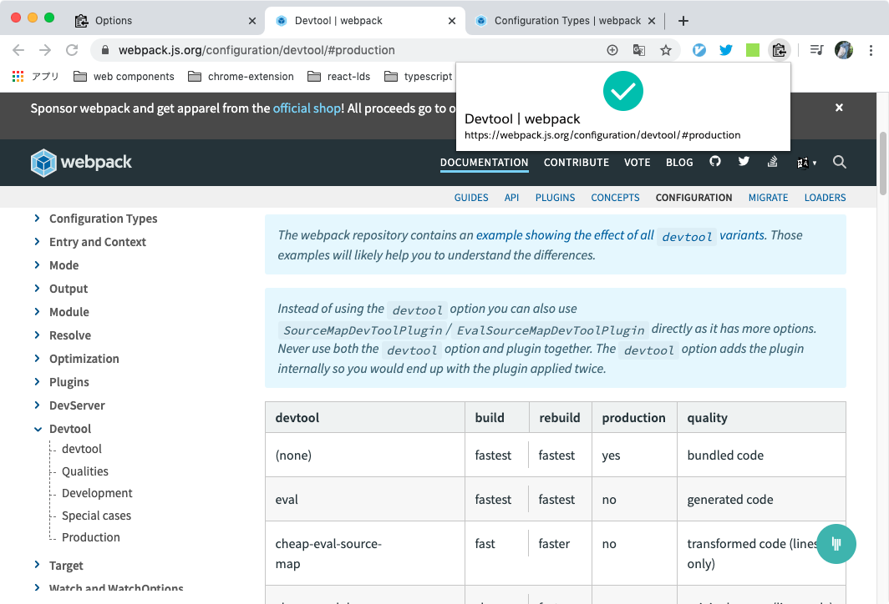

# Chrome Extension: Copy Title & Url as Markdown Style

Quickly copy the title & url of current tab as Markdown style (`[title](url)`).

## Installation & Usage

Chrome Web Store: https://chrome.google.com/webstore/detail/copy-title-and-url-as-mar/fpmbiocnfbjpajgeaicmnjnnokmkehil?hl=ja

日本語の説明はこちら。  
[ページのタイトルと URL を Markdown 形式でコピーする Chrome 拡張作った - dackdive's blog](http://dackdive.hateblo.jp/entry/2015/12/27/000000)

## Contributing

Thank you for taking an interest in this repository.
Since the source code also serves as my programming learning purpose, **I generally do not accept Pull Requests**.
However, I welcome issues related to feature requests and bug reports.
